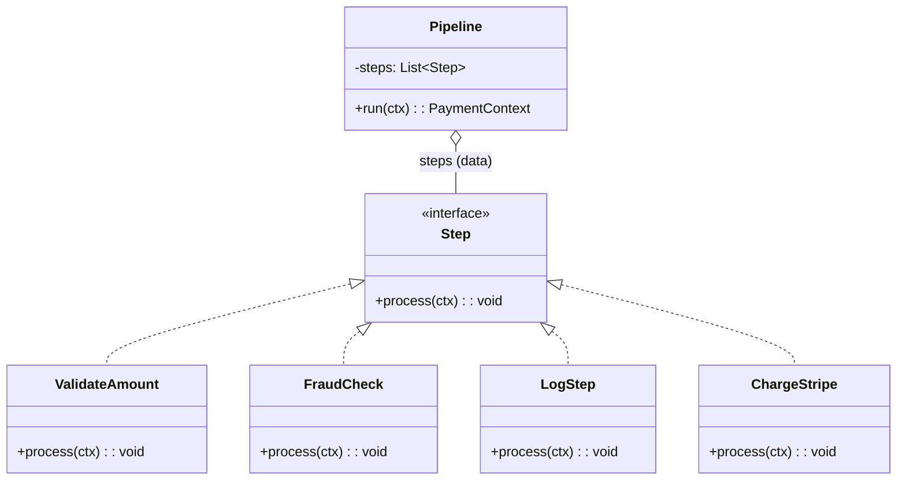

# Episode 9 Diagrams

## 2^n class explosion (ASCII)
```
Optional behaviors (axes): Logging, FraudCheck, Retries, Audit, Metrics ...

Each new optional behavior doubles combinations.

n=1 → 2
n=2 → 4
n=3 → 8
n=4 → 16
n=5 → 32
```

## Pipeline as “variation = data” (Mermaid)

