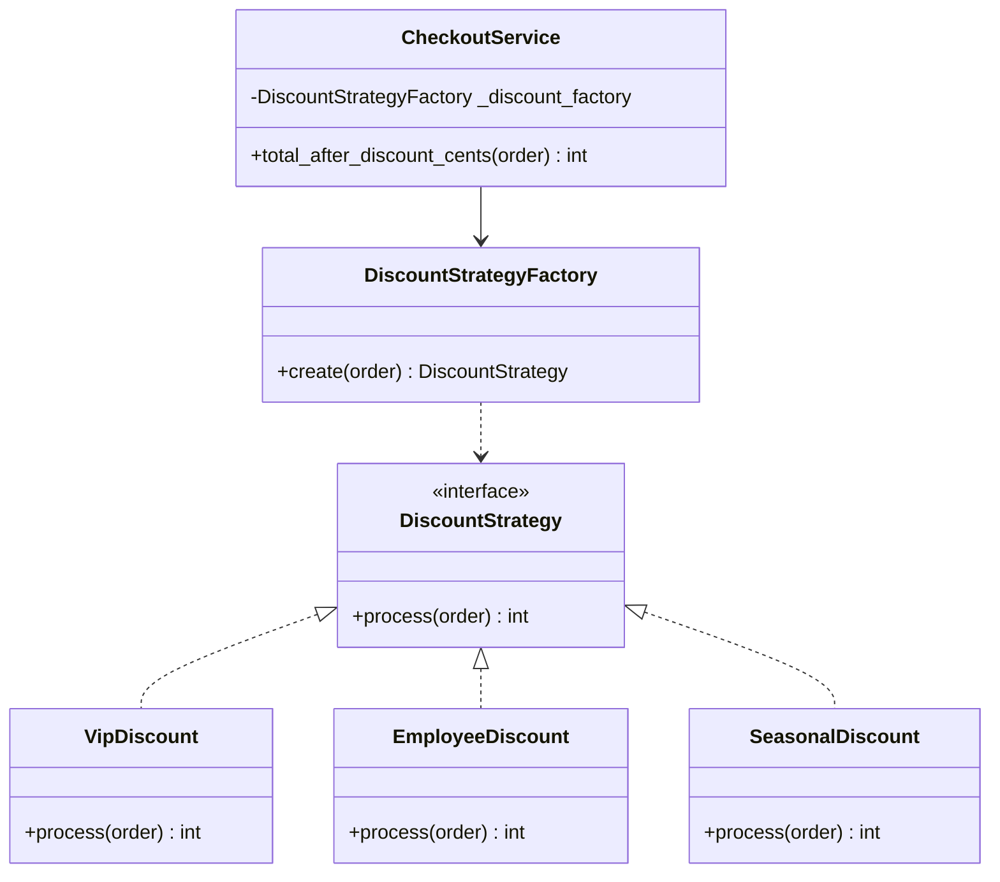

# Step 3 — Mermaid Class Diagram

```mermaid
classDiagram
    class CheckoutService {
      -DiscountStrategyFactory _discount_factory
      +total_after_discount_cents(order) int
    }

    class DiscountStrategyFactory {
      +create(order) DiscountStrategy
    }

    class DiscountStrategy {
      <<interface>>
      +process(order) int
    }

    class VipDiscount { +process(order) int }
    class EmployeeDiscount { +process(order) int }
    class SeasonalDiscount { +process(order) int }

    CheckoutService --> DiscountStrategyFactory
    DiscountStrategyFactory ..> DiscountStrategy
    DiscountStrategy <|.. VipDiscount
    DiscountStrategy <|.. EmployeeDiscount
    DiscountStrategy <|.. SeasonalDiscount
```
