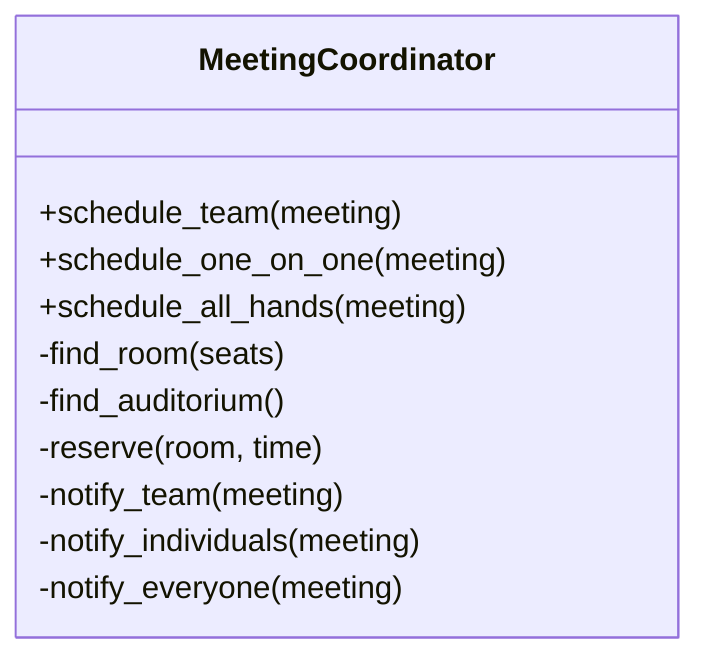
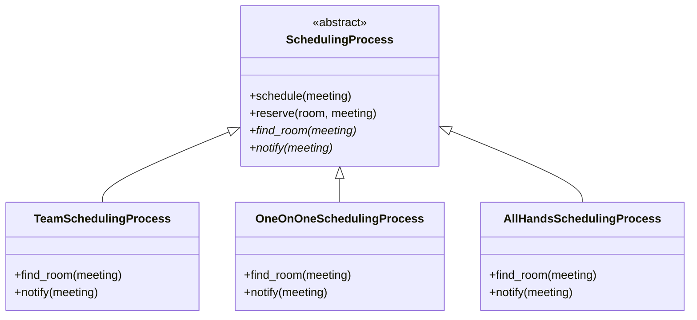
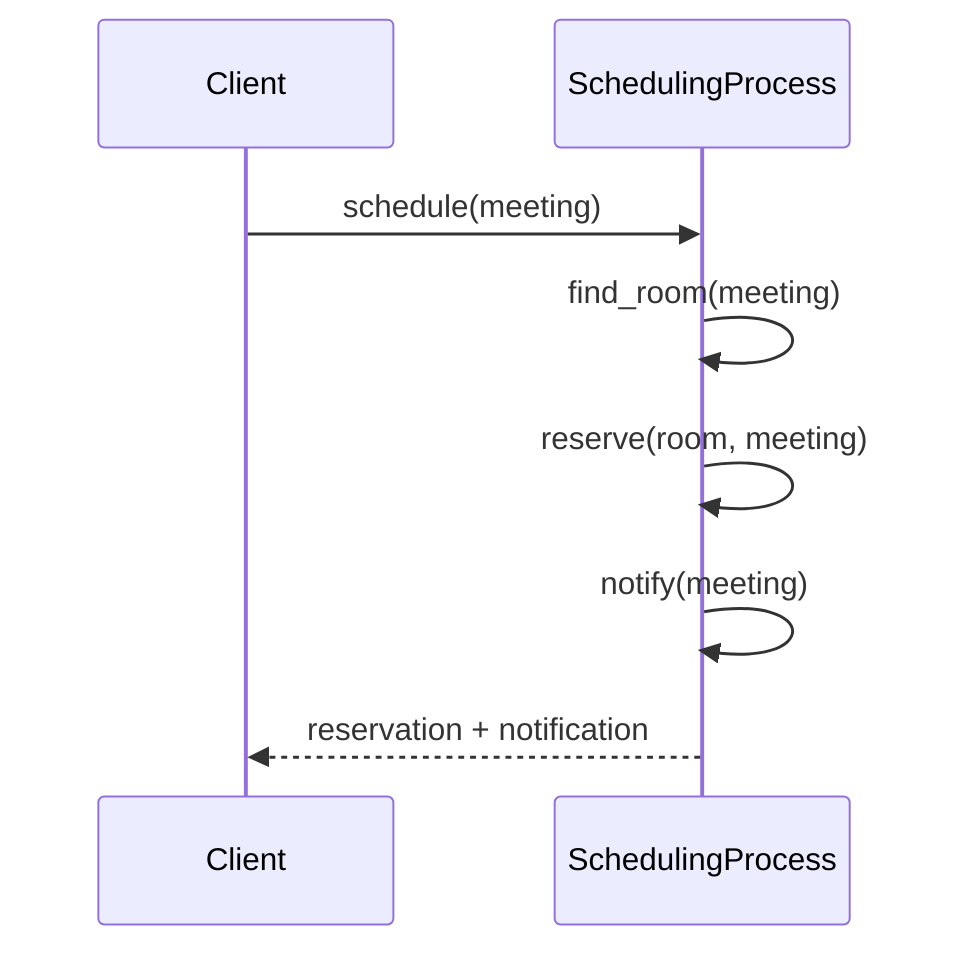

# UML — Before and After

## Before (duplicated parallel methods)

```mermaid
classDiagram
    class MeetingCoordinator {
        +schedule_team(meeting)
        +schedule_one_on_one(meeting)
        +schedule_all_hands(meeting)
        -find_room(seats)
        -find_auditorium()
        -reserve(room, time)
        -notify_team(meeting)
        -notify_individuals(meeting)
        -notify_everyone(meeting)
    }
```

## After (shared abstraction + isolated variation)

```mermaid
classDiagram
    class SchedulingProcess {
        <<abstract>>
        +schedule(meeting)
        +reserve(room, meeting)
        +find_room(meeting)*
        +notify(meeting)*
    }

    class TeamSchedulingProcess {
        +find_room(meeting)
        +notify(meeting)
    }

    class OneOnOneSchedulingProcess {
        +find_room(meeting)
        +notify(meeting)
    }

    class AllHandsSchedulingProcess {
        +find_room(meeting)
        +notify(meeting)
    }

    SchedulingProcess <|-- TeamSchedulingProcess
    SchedulingProcess <|-- OneOnOneSchedulingProcess
    SchedulingProcess <|-- AllHandsSchedulingProcess
```

## Object Interaction (after)

```mermaid
sequenceDiagram
    participant Client
    participant Process as SchedulingProcess
    Client->>Process: schedule(meeting)
    Process->>Process: find_room(meeting)
    Process->>Process: reserve(room, meeting)
    Process->>Process: notify(meeting)
    Process-->>Client: reservation + notification
```
