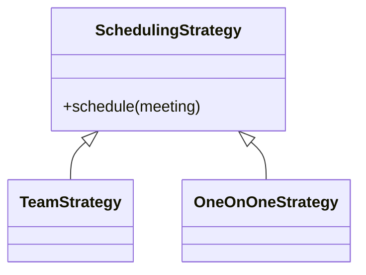
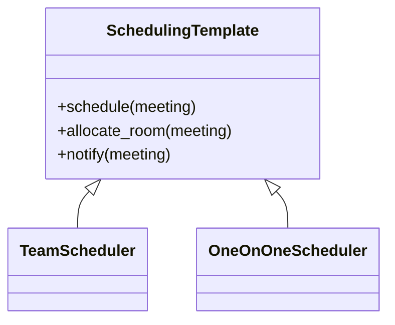
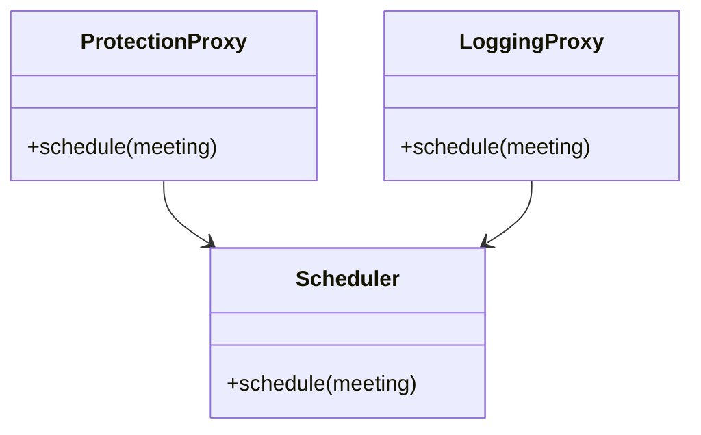
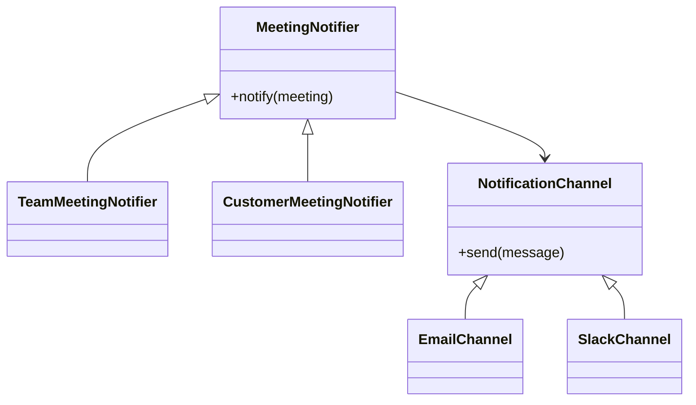

# UML — Strategy, Template Method, Proxy, Bridge

## Strategy

```mermaid
classDiagram
    class SchedulingStrategy {
        +schedule(meeting)
    }
    class TeamStrategy
    class OneOnOneStrategy
    SchedulingStrategy <|-- TeamStrategy
    SchedulingStrategy <|-- OneOnOneStrategy
```

## Template Method

```mermaid
classDiagram
    class SchedulingTemplate {
        +schedule(meeting)
        +allocate_room(meeting)
        +notify(meeting)
    }
    class TeamScheduler
    class OneOnOneScheduler
    SchedulingTemplate <|-- TeamScheduler
    SchedulingTemplate <|-- OneOnOneScheduler
```

## Proxy

```mermaid
classDiagram
    class Scheduler {
        +schedule(meeting)
    }
    class ProtectionProxy {
        +schedule(meeting)
    }
    class LoggingProxy {
        +schedule(meeting)
    }
    ProtectionProxy --> Scheduler
    LoggingProxy --> Scheduler
```

## Bridge

```mermaid
classDiagram
    class MeetingNotifier {
        +notify(meeting)
    }
    class TeamMeetingNotifier
    class CustomerMeetingNotifier
    class NotificationChannel {
        +send(message)
    }
    class EmailChannel
    class SlackChannel
    MeetingNotifier <|-- TeamMeetingNotifier
    MeetingNotifier <|-- CustomerMeetingNotifier
    MeetingNotifier --> NotificationChannel
    NotificationChannel <|-- EmailChannel
    NotificationChannel <|-- SlackChannel
```
