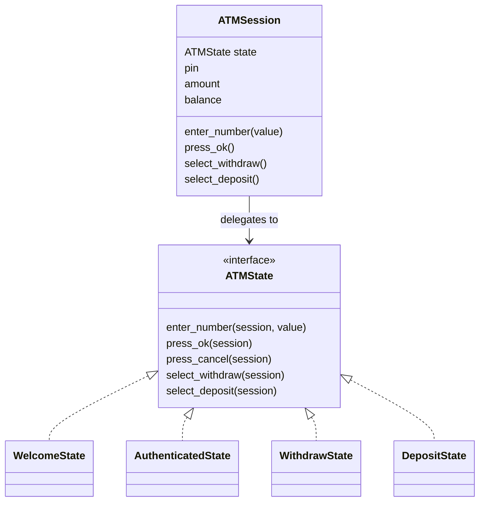
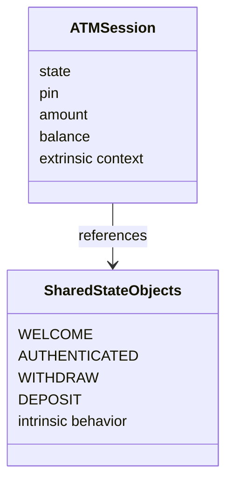

# UML / Diagram References

Generated diagrams are in `diagrams/` as SVG and PNG.

## State Pattern UML
- `diagrams/state_pattern_uml.svg`
- `diagrams/state_pattern_uml.png`

## Before / After Comparison
- `diagrams/before_after_comparison.svg`
- `diagrams/before_after_comparison.png`

## Flyweight With State Objects
- `diagrams/flyweight_state_objects.svg`
- `diagrams/flyweight_state_objects.png`

## Mermaid source: State Pattern

## Mermaid source: Flyweight framing

